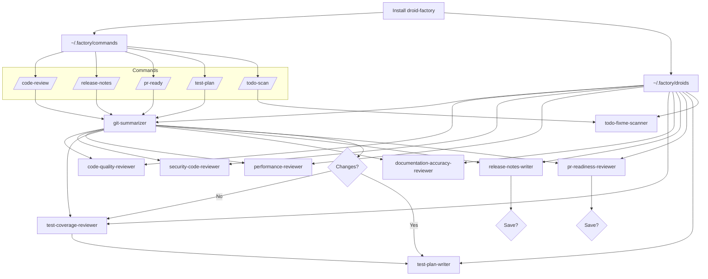

# Droid Factory install

Install custom Factory Droid subagents and delegate work using custom slash commands with a single `npx droid-factory` (or `bunx droid-factory`) call. The installer defaults to copying *all* available commands and droids into your personal Factory workspace (`~/.factory/{commands,droids}`) and offers granular control when you need it.

## Usage

```bash
npx droid-factory
```
```bash
bunx droid-factory
```

The interactive flow shows an install plan, highlights pre-existing files, and asks for confirmation before writing. Add `--yes` to skip the prompt or `--dry-run` to preview without writing.

Ensure **Custom Droids** are enabled in Factory (`/settings` → Experimental → Custom Droids) or by adding `"enableCustomDroids": true` to `~/.factory/settings.json`; otherwise the installed commands cannot launch their helper agents.

### Common variations

| Goal | Command |
| --- | --- |
| Install everything (explicit) | `npx droid-factory --commands all --droids all` (or use `bunx`) |
| Install only commands | `npx droid-factory --only-commands --commands all` |
| Install a single command | `npx droid-factory --only-commands --commands code-review` |
| Install only droids | `npx droid-factory --only-droids --droids all` |
| Install specific droids | `npx droid-factory --only-droids --droids security-code-reviewer,test-coverage-reviewer` |
| Target a project repo | `npx droid-factory --scope project --path /path/to/repo --commands all --droids all` |
| Generate PR readiness report | `npx droid-factory --only-commands --commands pr-ready` |
| Draft a focused test plan | `npx droid-factory --only-commands --commands test-plan` |
| Scan for TODO/FIXME markers | `npx droid-factory --only-commands --commands todo-scan` |
| Force overwrite existing files | add `--force` |
| Disable spinner | add `--no-spinner` |
| List templates | `npx droid-factory --list` (or `bunx`) |

## Contributing commands or droids

1. Fork this repository.
2. Add or modify Markdown templates in `templates/commands/` or `templates/droids/`.
3. Run `npm test` or `npm run lint` if scripts are provided (future roadmap).
4. Verify your changes locally (see "Local development" below).
5. Commit with clear messages and open a pull request against the main branch.
6. Include before/after installer output as needed to demonstrate your change.

## Local development

```bash
git clone https://github.com/iannuttall/droid-factory.git
cd droid-factory
npm install

node bin/droid-factory.js --dry-run --no-spinner --yes
node bin/droid-factory.js --yes
```

Use `npm pack` to sanity-check the tarball before publishing, and remember to bump `package.json` versions per semantic versioning guidelines.

## Overview


